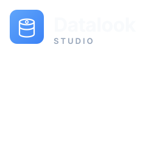

# Datalook Studio

A self-hosted, browser-based database management dashboard for teams. Connect to PostgreSQL, MySQL, MongoDB, Redis, Cassandra, and more — all from a single, polished web UI with role-based access control, encrypted credentials, and zero backend dependencies.



## Why Datalook Studio?

Most database GUIs are desktop applications (DBeaver, TablePlus) or single-vendor web tools (phpMyAdmin, MongoDB Compass). Teams that manage multiple database engines end up juggling several tools, each with its own auth model and no shared visibility.

**Datalook Studio** solves this by providing:

- **Multi-engine support** — 11 database drivers (PostgreSQL, MySQL, MSSQL, CockroachDB, ClickHouse, MongoDB, CouchDB, Redis, Cassandra, DynamoDB, SQLite) from one interface.
- **Role-based access control** — Built-in roles (Admin, Editor, Viewer) plus custom roles with fine-grained permissions. Shared and personal connections.
- **Credentials encrypted at rest** — AES-GCM encryption via the Web Crypto API. Connection credentials are never stored in plaintext.
- **Zero backend** — The entire app runs in the browser. Data is persisted in IndexedDB. No server, no database to manage.
- **Team-ready** — Shared connections with per-user grants, audit logging, and an admin console for user management.
- **SQL editor + data browser** — Write queries with syntax highlighting, browse table data, export results in CSV/TSV/JSON/Text formats.
- **Query storage** — Save and reload queries per database type with IndexedDB persistence.
- **YAML import/export** — Define connection configurations as YAML files for version control and reproducible deployments.
- **Customizable theming** — Light/dark mode with 6 accent colors, persisted per device.

## Architecture

```
┌─────────────────────────────────────────────────────┐
│                    Browser (client)                   │
│                                                       │
│  ┌─────────────┐  ┌──────────────┐  ┌─────────────┐ │
│  │  React 19    │  │  Next.js 16  │  │ Tailwind v4 │ │
│  │  UI Layer    │  │  App Router  │  │  + shadcn   │ │
│  └──────┬───────┘  └──────┬───────┘  └─────────────┘ │
│         │                  │                          │
│  ┌──────┴──────────────────┴──────────────────────┐ │
│  │              State Management                   │ │
│  │  AuthProvider · WorkspaceProvider · ThemeProvider│ │
│  └──────┬──────────────────────────────────────────┘ │
│         │                                             │
│  ┌──────┴──────────────────────────────────────────┐ │
│  │           IndexedDB Persistence                  │ │
│  │  meta · connections · queries · audit            │ │
│  └──────┬──────────────────────────────────────────┘ │
│         │                                             │
│  ┌──────┴──────────────────────────────────────────┐ │
│  │        Web Crypto API (AES-GCM)                  │ │
│  │     Connection credential encryption at rest     │ │
│  └─────────────────────────────────────────────────┘ │
└─────────────────────────────────────────────────────┘
```

### Key directories

| Path | Purpose |
|---|---|
| `app/` | Next.js App Router pages and layout |
| `components/` | React UI components (workspace, auth, providers, UI primitives) |
| `components/providers/` | Context providers for auth, workspace, theme |
| `components/workspace/` | Main workspace UI — navigator, SQL editor, results grid, tabs |
| `lib/` | Core logic — types, drivers, RBAC, persistence, encryption |
| `docker/` | Dockerfile and docker-compose for self-hosted deployment |
| `docs/` | MkDocs documentation source |
| `.github/workflows/` | CI/CD pipelines |

## Quick start

### Prerequisites

- Node.js 22+
- pnpm 9+

### Development

```bash
pnpm install
pnpm dev
```

Open [http://localhost:3000](http://localhost:3000). The app runs in development mode with demo data and quick-login shortcuts.

### Local databases (optional)

Spin up real database instances for testing connections:

```bash
pnpm db:up        # start all databases via Docker
pnpm db:down      # stop
pnpm db:reset     # stop and wipe volumes
```

## Deployment

### Option 1: Docker (recommended for self-hosting)

```bash
# Build and start the app + databases
docker compose -f docker/docker-compose.yaml up -d

# Or just the app
docker compose -f docker/docker-compose.yaml up -d app
```

The app is available at `http://localhost:3000`.

**Environment variables** (see `.env.example`):

| Variable | Default | Description |
|---|---|---|
| `NEXT_PUBLIC_APP_ENV` | `development` | `production` for real deployments |
| `NEXT_PUBLIC_DEFAULT_DB_DRIVER` | `postgres` | System store driver on first run |
| `NEXT_PUBLIC_DEFAULT_ADMIN_NAME` | `Admin` | Initial admin display name |
| `NEXT_PUBLIC_DEFAULT_ADMIN_EMAIL` | `admin@yourcompany.com` | Initial admin email |
| `NEXT_PUBLIC_DEFAULT_ADMIN_PASSWORD` | `datalook` | Initial admin password |
| `NEXT_PUBLIC_SYSTEM_DB_NAME` | `datalook-studio` | System database name |
| `NEXT_PUBLIC_AES_KEY` | _(auto-generated)_ | Base64-encoded 256-bit AES key for credential encryption |

### Option 2: Vercel

```bash
vercel          # preview deployment
vercel --prod   # production deployment
```

Set the environment variables in the Vercel dashboard or via CLI:

```bash
vercel env add NEXT_PUBLIC_APP_ENV
vercel env add NEXT_PUBLIC_DEFAULT_ADMIN_EMAIL
# ... etc
```

### Option 3: Standalone Node.js

```bash
pnpm build
node .next/standalone/server.js
```

## Documentation

Full documentation is available at [docs.datalook.dev](https://docs.datalook.dev) (deployed on Cloudflare Workers).

To run docs locally:

```bash
pip install mkdocs mkdocs-material
mkdocs serve
```

## Tech stack

- **Framework**: Next.js 16 (App Router, Turbopack)
- **UI**: React 19, Tailwind CSS v4, shadcn/ui, Lucide icons
- **State**: React Context (AuthProvider, WorkspaceProvider, ThemeProvider)
- **Persistence**: IndexedDB with AES-GCM encryption (Web Crypto API)
- **Language**: TypeScript 5.7
- **Package manager**: pnpm

## License

Apache-2.0 — see [LICENSE](LICENSE).

## Contributing

See [CONTRIBUTING.md](CONTRIBUTING.md). By participating, you agree to abide by the [Code of Conduct](CODE_OF_CONDUCT.md).
